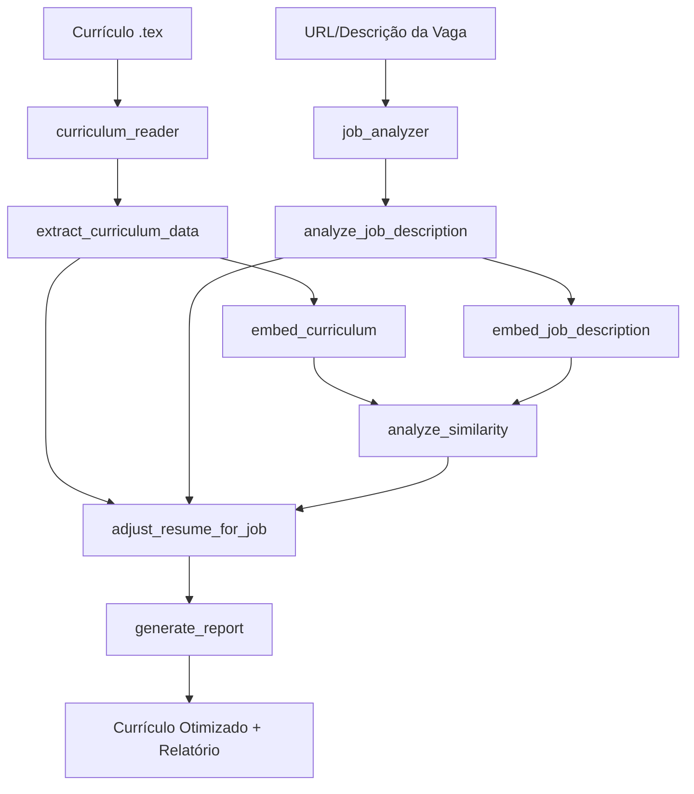

# Documentação Técnica - Resume Optimizer Crew

## Arquitetura do Sistema

### Visão Geral
O Resume Optimizer Crew é um sistema multi-agente baseado no framework CrewAI que automatiza a otimização de currículos LaTeX baseado em descrições de vagas de emprego.

### Componentes Principais

#### 1. Agentes (src/config/agents.yaml)
- **curriculum_reader**: Especialista em leitura e análise de currículos .tex
- **job_analyzer**: Analista de descrições de vagas de emprego
- **alignment_analyzer**: Especialista em análise semântica e similaridade
- **resume_editor**: Editor especializado em otimização de currículos
- **reporting_agent**: Gerador de relatórios detalhados

#### 2. Tarefas (src/config/tasks.yaml)
- **extract_curriculum_data**: Extração de dados estruturados do currículo
- **analyze_job_description**: Análise da descrição da vaga
- **embed_curriculum**: Geração de embeddings do currículo
- **embed_job_description**: Geração de embeddings da vaga
- **analyze_similarity**: Análise de similaridade semântica
- **adjust_resume_for_job**: Otimização do currículo
- **generate_report**: Geração de relatório final

#### 3. Ferramentas (src/tools/)
- **LatexReaderTool**: Leitura e parsing de arquivos LaTeX
- **JobDescriptionTool**: Extração de descrições de vagas (URL/texto)
- **EmbeddingTool**: Geração de embeddings semânticos
- **SimilarityTool**: Cálculo de similaridade entre embeddings
- **PDFReaderTool**: Leitura de arquivos PDF

### Fluxo de Execução



### Tecnologias Utilizadas

#### Framework Principal
- **CrewAI**: Orquestração de agentes AI
- **Python 3.8+**: Linguagem base

#### LLM e APIs
- **Google Gemini**: LLM principal
- **OpenAI GPT**: LLM alternativo
- **ChromaDB**: Banco de embeddings vetoriais

#### Processamento de Documentos
- **pylatexenc**: Parsing de LaTeX
- **PyPDF2**: Leitura de PDFs
- **BeautifulSoup**: Web scraping

#### Interface e Utilidades
- **Streamlit**: Interface web
- **uv**: Gerenciamento de pacotes
- **python-dotenv**: Configuração de ambiente

### Estrutura de Dados

#### Entrada
- **Currículo**: Arquivo .tex ou PDF
- **Vaga**: URL ou texto da descrição

#### Saída
- **Currículo otimizado**: Arquivo .tex modificado
- **Relatórios**: Análises detalhadas em Markdown
- **Métricas**: Scores de similaridade e alinhamento

### Configuração e Deployment

#### Variáveis de Ambiente Obrigatórias
```env
GEMINI_API_KEY=your_api_key
```

#### Variáveis Opcionais
```env
OPENAI_API_KEY=optional_openai_key
SERPER_API_KEY=optional_serper_key
DEBUG=false
VERBOSE=true
```

#### Instalação
```bash
# Clone e configure
git clone <repo>
cd resume-optimizer-crew
make setup

# Configure .env com suas chaves
# Execute
make run
```

### Extensibilidade

#### Adicionando Novos Agentes
1. Defina o agente em `src/config/agents.yaml`
2. Implemente o método correspondente em `src/crew.py`
3. Adicione ferramentas específicas se necessário

#### Adicionando Novas Ferramentas
1. Crie arquivo em `src/tools/`
2. Implemente com decorator `@tool`
3. Registre em `src/tools/__init__.py`
4. Adicione aos agentes relevantes

#### Personalizando Tarefas
1. Modifique `src/config/tasks.yaml`
2. Ajuste o fluxo em `src/crew.py`
3. Teste com diferentes inputs

### Monitoramento e Debug

#### Logs
- **crew_debug.log**: Logs detalhados de execução
- **reports/**: Relatórios por tarefa
- **temp/**: Arquivos temporários de debug

#### Métricas
- **Similaridade semântica**: Score 0-1
- **Tempo de execução**: Por tarefa e total
- **Qualidade da otimização**: Avaliação manual

### Limitações Conhecidas

1. **Dependência de API**: Requer acesso a LLMs externos
2. **Formato LaTeX**: Limitado a currículos .tex bem estruturados
3. **Idioma**: Otimizado para português brasileiro
4. **Rate Limits**: Sujeito a limites das APIs utilizadas

### Roadmap Futuro

- [ ] Suporte a múltiplos formatos (DOCX, HTML)
- [ ] Interface web mais avançada
- [ ] Integração com LinkedIn API
- [ ] Análise de mercado automática
- [ ] Templates de currículo personalizáveis
- [ ] Sistema de feedback e aprendizado contínuo
